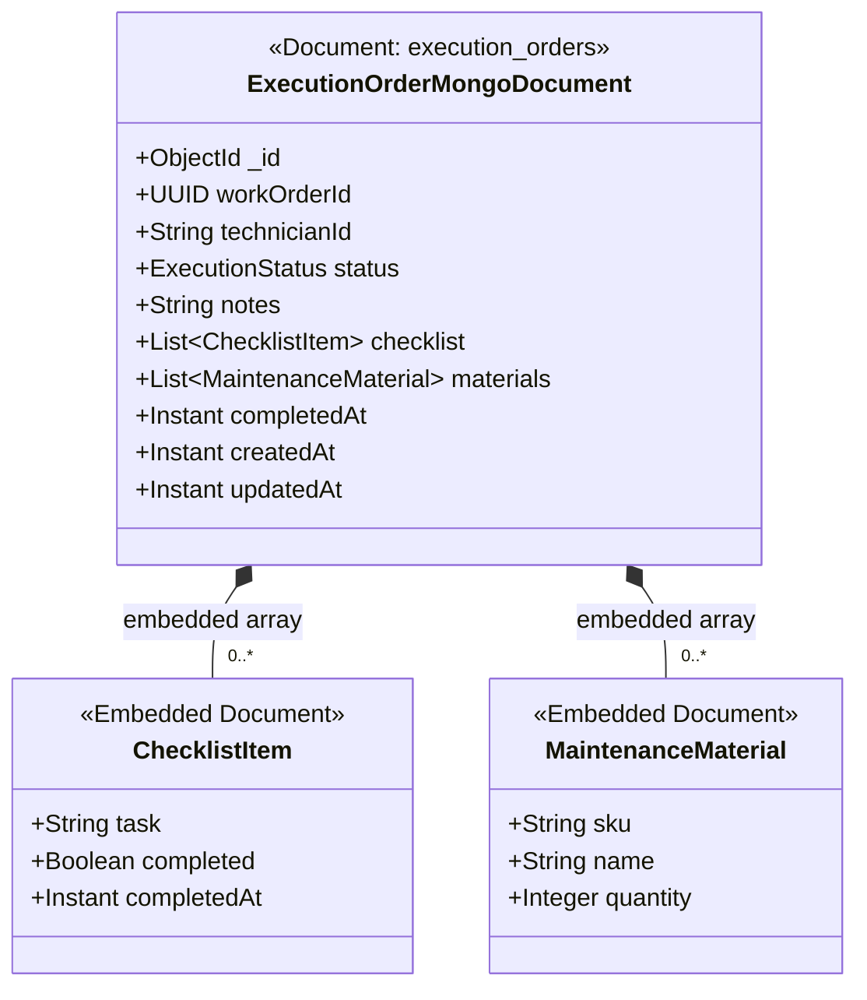

# Microsserviço de Execução de Oficina (`15soat-phase4-api-exec`)

Microsserviço responsável pela gestão da fila física de execução da oficina mecânica, diagnósticos, reparos em baia e comunicação de conclusão na Saga coreografada via Apache Kafka.

## Arquitetura & Tecnologias
- **Java 25 LTS**
- **Spring Boot 4.0.7** & Spring Data MongoDB
- **Arquitetura Hexagonal (Ports & Adapters)**:
  - `domain`: Regras puras de negócio, sem dependência de frameworks.
  - `application`: Drivers Spring Boot, adaptadores de repositório de documentos MongoDB, consumidores e produtores de eventos Kafka, controllers REST.
- **Banco de Dados**: MongoDB (NoSQL) com armazenamento orientado a documentos para checklists dinâmicos, apontamentos de técnicos e ciclo de vida da execução.
- **Mensageria de Eventos**: Apache Kafka para coreografia distribuída da Saga.
- **Design API First**: OpenAPI 3.0 (`contracts/openapi.yaml`) & AsyncAPI (`contracts/asyncapi.yaml`).
- **Conteinerização & Deploy**: Build multi-stage com Docker, charts Helm para Kubernetes / Kong Ingress.

## Endpoints da API
- `POST /api/v1/executions` - Enfileira uma nova ordem de execução na oficina.
- `GET /api/v1/executions/queue` - Consulta a fila de execução ativa da oficina.
- `GET /api/v1/executions/{id}` - Obtém os detalhes completos de uma ordem de execução por ID.
- `PATCH /api/v1/executions/{id}/status` - Atualiza o status da execução física (`QUEUED`, `IN_REPAIR`, `COMPLETED`).
- `POST /api/v1/executions/{id}/checklist` - Adiciona ou atualiza um item de inspeção técnica no checklist.

## Eventos Kafka
- **Consome**: `payment-events` (O evento `PaymentConfirmedEvent` aciona a entrada automática na fila da oficina).
- **Publica**: `execution-events` (`ExecutionStartedEvent`, `ExecutionCompletedEvent`, `ExecutionFailedEvent`).

## Modelo de Dados: NoSQL Orientado a Documentos (MongoDB / AWS DocumentDB)

Diferente dos microsserviços relacionais, o **`api-exec`** utiliza o banco de dados orientado a documentos **MongoDB** (`exec_db`). 

Seguindo o padrão de **Agregados do DDD (Aggregate Root)**, a ordem de execução física (`execution_orders`) armazena atomicamente suas inspeções de checklist e peças aplicadas como **subdocumentos e arrays embutidos (Embedded Documents)**, dispensando tabelas normalizadas e joins relacionais:

<div style="overflow-x: auto; width: 100%;">
<div style="min-width: 800px;">



</div>
</div>

### Exemplo de Documento BSON / JSON Persistido no MongoDB
```json
{
  "_id": { "$oid": "66f4b1a23c4d5e6f7a8b9c0d" },
  "workOrderId": "a1b2c3d4-e5f6-7a8b-9c0d-e1f2a3b4c5d6",
  "technicianId": "TECH-CARLOS-01",
  "status": "IN_REPAIR",
  "notes": "Veículo com desgaste acentuado nas pastilhas dianteiras. Substituição efetuada.",
  "checklist": [
    {
      "task": "Verificar nível e viscosidade do óleo do motor",
      "completed": true,
      "completedAt": "2026-10-01T14:30:00Z"
    },
    {
      "task": "Inspecionar espessura das pastilhas e discos de freio",
      "completed": true,
      "completedAt": "2026-10-01T15:10:00Z"
    }
  ],
  "materials": [
    {
      "sku": "PART-BRK-01",
      "name": "Pastilha de Freio Dianteira Cerâmica",
      "quantity": 2
    }
  ],
  "createdAt": "2026-10-01T14:00:00Z",
  "updatedAt": "2026-10-01T15:15:00Z",
  "completedAt": null
}
```

## Compilação & Testes
```bash
mvn clean test
```

## 🏛️ Architecture Decision Records (ADRs)

- **[Catálogo de ADRs do Microsserviço](docs/adr/README.md)**: Decisões específicas de Execução de Oficina (Modelagem Documental MongoDB com Checklists e Materiais Embutidos).
- **[Catálogo Global de ADRs (lib-commons)](../15soat-phase4-lib-commons/docs/adr/README.md)**: Padrões transversais compartilhados (Database-per-Service, Saga Kafka, Pragmatic DDD, Tabelas no Singular, Java 25 / Spring Boot 4).
